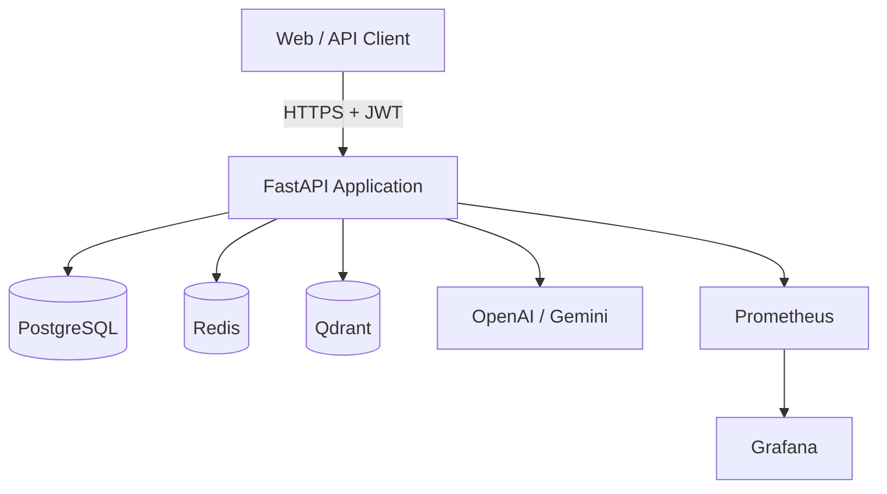

# Enterprise RAG Platform — Architecture

## Overview

Production-grade Retrieval-Augmented Generation (RAG) platform enabling multi-user document ingestion, semantic search, grounded answer generation with citations, and operational observability.

## Design Principles

| Principle | Application |
|-----------|-------------|
| **Clean Architecture** | Dependencies point inward: `api` → `services` → `repositories` / `rag` → `models` |
| **SOLID** | Single-responsibility services; repository interfaces for testability |
| **12-Factor App** | Config via environment; stateless API workers; backing services as containers |
| **Fail Fast** | Input validation at API boundary; typed errors mapped to HTTP status codes |
| **Observability First** | Structured logging + Prometheus metrics on every critical path |

## System Context



## Layered Architecture

```
┌─────────────────────────────────────────────────────────┐
│  API Layer (app/api)                                    │
│  Routes, request/response schemas, dependency injection │
├─────────────────────────────────────────────────────────┤
│  Service Layer (app/services)                           │
│  Business logic: auth, upload, chat, documents          │
├─────────────────────────────────────────────────────────┤
│  RAG Layer (app/rag)                                    │
│  Ingestion, retrieval, reranking, generation pipeline   │
├─────────────────────────────────────────────────────────┤
│  Repository Layer (app/repositories)                    │
│  Data access abstraction over SQLAlchemy                  │
├─────────────────────────────────────────────────────────┤
│  Infrastructure (app/database, app/config, app/logging) │
│  DB sessions, settings, structured logging, metrics     │
└─────────────────────────────────────────────────────────┘
```

### Dependency Rule

- **API** depends on **Services** and **Schemas** only.
- **Services** depend on **Repositories**, **RAG**, and **Schemas**.
- **Repositories** depend on **Models** and **Database**.
- **RAG** depends on external clients (Qdrant, embedding model, LLM) via injected interfaces.

No layer below `services` imports from `api`.

## RAG Pipeline (LangGraph)

```
User Query
    ↓
Query Cleaner          — normalize whitespace, strip PII patterns (extensible)
    ↓
Embedding Generator    — sentence-transformers (local) or API fallback
    ↓
Vector Search          — Qdrant ANN search, user-scoped collection filter
    ↓
Metadata Filter        — document_id, file_type, date range
    ↓
Reranker               — cross-encoder or score fusion
    ↓
Context Builder        — token-budget aware chunk assembly
    ↓
Prompt Template        — system + context + user message
    ↓
LLM                    — OpenAI / Gemini with streaming
    ↓
Answer Generator       — structured output parsing
    ↓
Citation Generator     — map claims → chunk sources
    ↓
Response               — SSE stream to client
```

Each stage is a **LangGraph node** with explicit state, enabling retries, logging per node, and future branching (e.g., query rewriting).

## Data Model Strategy

| Store | Responsibility |
|-------|----------------|
| **PostgreSQL** | Users, documents, chunk metadata, conversations, messages, feedback, audit logs |
| **Qdrant** | Dense vectors keyed by `chunk_id`; payload holds `user_id`, `document_id`, text preview |
| **Redis** | JWT blocklist (optional), rate-limit counters, embedding cache |

Vectors live in Qdrant; relational integrity and chat history live in PostgreSQL. Chunk rows in PG reference Qdrant point IDs for reconciliation.

## Security Model

- **Authentication**: JWT (HS256) with configurable expiry; bcrypt password hashing.
- **Authorization**: All document and chat operations scoped by `user_id` from token.
- **Rate Limiting**: Redis sliding window per user/IP on `/chat` and `/upload`.
- **File Validation**: MIME sniffing, size limits, extension allowlist (pdf, docx, txt).
- **Input Validation**: Pydantic v2 at every endpoint.

## API Surface (v1)

| Method | Path | Description |
|--------|------|-------------|
| POST | `/auth/register` | Create account |
| POST | `/auth/login` | Obtain JWT |
| POST | `/upload` | Ingest document |
| POST | `/chat` | Query with RAG (supports SSE stream) |
| GET | `/history` | List conversations |
| GET | `/documents` | List user documents |
| DELETE | `/document/{id}` | Remove document + vectors |
| GET | `/health` | Liveness |
| GET | `/metrics` | Prometheus scrape endpoint |

## Deployment Topology (Docker Compose)

Services: `api`, `postgres`, `redis`, `qdrant`, `prometheus`, `grafana`.

Production target: **Render** (managed Postgres + web service) or **AWS ECS/Fargate** with RDS, ElastiCache, and self-hosted or cloud Qdrant.

## Technology Choices — Rationale

| Choice | Why |
|--------|-----|
| **FastAPI** | Native async, OpenAPI, Pydantic integration, production-proven |
| **LangGraph** | Explicit state machine for RAG; easier debugging than opaque chains |
| **Qdrant** | High-performance vector search, filtering, Docker-friendly |
| **sentence-transformers** | Cost control for embeddings; no API latency for ingestion |
| **PostgreSQL** | ACID for users/conversations; mature ecosystem |
| **Redis** | Sub-ms rate limiting and cache |
| **Prometheus + Grafana** | Industry standard for SLO tracking |

## Non-Functional Requirements

- **Latency SLO**: p95 chat < 8s (excluding LLM); retrieval p95 < 500ms
- **Availability**: Stateless API; horizontal scaling behind load balancer
- **Testability**: Repository fakes; RAG pipeline unit-tested per node

## Implementation Phases

1. Architecture ← *current*
2. Folder structure
3. Dependencies
4. Database
5. Authentication
6. Upload service
7. RAG pipeline
8. APIs
9. Testing
10. Docker
11. Monitoring
12. Deployment
